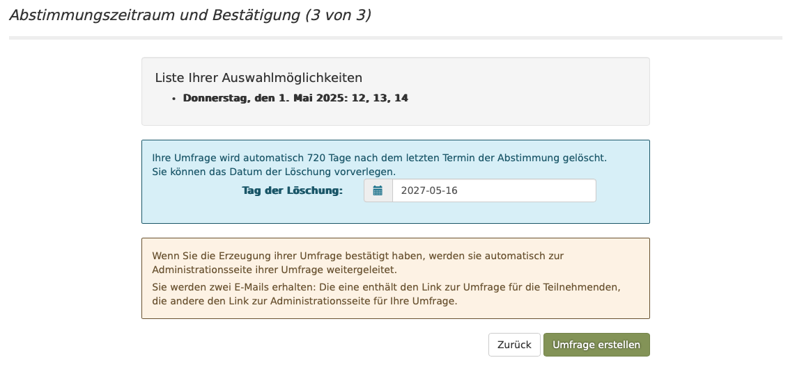

# Requirement 6: Implement Step 3 of "Schedule Event" Form

As a user, I want to go from the step-2 page to a new `schedule-event-step3` page to finalize the event details.

## TDD Development Plan

This feature will be implemented following a strict Test-Driven Development approach. Each step below represents a test (or a set of tests) that should be written and fail before any production code is implemented.

### Step 1: Navigate from Step 2 to Step 3

**User Story:** When I am on the "Schedule Event - Step 2" page, I want to click a "Next" button to proceed to "Step 3".

**Test Case: `navigateToStep3FromStep2`**
*   **Given:** The user is on the `schedule-event-step2` page for a given poll.
*   **When:** The user submits the form (e.g., by clicking a "Next" button).
*   **Then:** The application should redirect to the `schedule-event-step3` page, passing along the poll's unique identifier (UUID).

### Step 2: Display the Step 3 Form

**User Story:** As a user on the "Step 3" page, I want to see the form for finalizing my poll.

**Test Case: `displayStep3FormElements`**
*   **Given:** The user navigates to the `schedule-event-step3` page with a valid poll UUID.
*   **When:** The page loads.
*   **Then:** The view should contain the following HTML elements:
    *   A form (`<form>`).
    *   An input for "Expiry Date" (`<input type="date" name="expiryDate">`).
    *   A "Back" button (`<button type="submit" formaction="/schedule-event-step2/{uuid}">`).
    *   A "Create the poll" button.

### Step 3: Navigate Back from Step 3 to Step 2

**User Story:** As a user on "Step 3", if I realize I made a mistake in the previous step, I want to go back to "Step 2" without losing my data.

**Test Case: `navigateBackToStep2FromStep3`**
*   **Given:** The user is on the `schedule-event-step3` page.
*   **When:** The user clicks the "Back" button.
*   **Then:** The application should display the `schedule-event-step2` page with the previously entered data pre-filled.

### Step 4: Implement Default Expiry Date Logic

**User Story:** As a user, to save time, I want the "Expiry Date" to have a sensible default value based on the dates I chose for the poll.

**Test Case: `expiryDateDefaultsToThreeMonthsAfterLastPollDate`**
*   **Given:** A poll has a set of dates, with the latest date being `YYYY-MM-DD`.
*   **When:** The user loads the `schedule-event-step3` page for that poll.
*   **Then:** The "Expiry Date" input field should have a default value of `YYYY-MM-DD` plus three months.

### Step 5: Handle Invalid Access to Step 3

**User Story:** As a user, I should not be able to jump to "Step 3" of creating a poll without having gone through the previous steps.

**Test Case: `redirectToStartWhenAccessingStep3WithoutUUID`**
*   **Given:** A user tries to access the `schedule-event-step3` URL.
*   **When:** The URL does not contain a poll UUID.
*   **Then:** The user should be redirected to the initial `schedule-event` page.
*   **And:** A warning message "The UUID was not found" should be displayed.

**Test Case: `redirectToStartWhenAccessingStep3WithInvalidUUID`**
*   **Given:** A user tries to access the `schedule-event-step3/{uuid}` URL.
*   **When:** The provided `uuid` does not exist.
*   **Then:** The user should be redirected to the initial `schedule-event` page.
*   **And:** A warning message "The UUID was not found" should be displayed. 