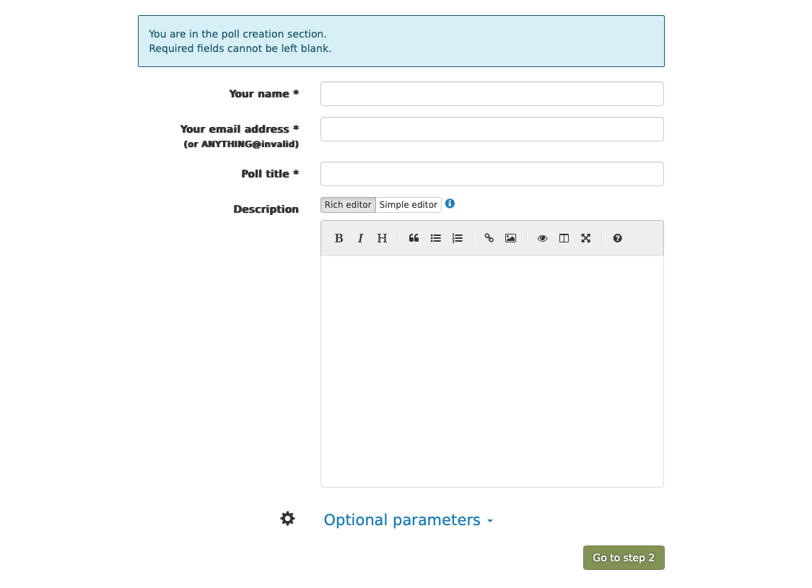

# requirement 5a - Form Data Persistence

**User Story:** As a user, I want my form data to be automatically saved so that I can return later to modify or continue my event scheduling.

## Implementation Strategy
- **Architecture:** Stateless backend with S3-compatible storage
- **Storage:** MinIO (dev/test) → AWS S3 (production)
- **Data Format:** JSON objects with UUID keys
- **URL Pattern:** `/schedule-event/{uuid}` for persistence

## Acceptance Criteria

### 1. Form Submission & UUID Generation
- **WHEN** user fills out the schedule-event form and clicks "Next"
- **THEN** system generates a UUID (e.g., `123e4567-e89b-12d3-a456-426655440000`)
- **AND** form data is saved to S3 with UUID as object key

### 2. Data Storage Requirements
- **WHAT:** Store form data as JSON in S3-compatible storage
- **WHERE:** Bucket `de.bas.bodo`, server alias `myminio`
- **KEY:** UUID string (e.g., `123e4567-e89b-12d3-a456-426655440000.json`)
- **CONTENT:** JSON object with form fields: `{ "name": "...", "email": "...", "activityTitle": "...", "description": "..." }`

### 3. Stateless Backend Requirement
- **NO** Spring Boot sessions or server-side state
- **ALL** user data must be stored in S3
- **EACH** request must be independent

### 4. URL-based Data Retrieval
- **WHEN** user visits `/schedule-event/{uuid}` (e.g., `/schedule-event/123e4567-e89b-12d3-a456-426655440000`)
- **THEN** system retrieves data from S3 using the UUID
- **AND** pre-fills form fields with stored data
- **IF** UUID not found, show empty form, generate a new UUID

### 5. Navigation Flow
- **WHEN** user clicks "Next" on form
- **THEN** redirect to `/schedule-event-step2/{uuid}`
- **AND** UUID is preserved in URL for subsequent steps
- **IF** a UUID given in the URL is not found, redirect to `/schedule-event/` and show an empty form

### 6. Infrastructure Configuration
- **TESTS:** Use local MinIO instance (started via `./minio-start.sh`)
- **PRODUCTION:** AWS S3 configured in `application.yml`
- **BUCKET:** `de.bas.bodo` (must exist)

## Test Scenarios
1. **New Form:** Visit `/schedule-event` → fill form → click Next → verify UUID generated and data stored
2. **Data Retrieval:** Visit `/schedule-event/{existing-uuid}` → verify form pre-filled with stored data
3. **Invalid UUID:** Visit `/schedule-event/{non-existent-uuid}` → verify empty form shown
4. **S3 Storage:** Verify JSON object stored with correct structure and UUID key

## Technical Requirements
- **Form Fields:** name, email, activityTitle, description
- **UUID Format:** Standard UUID v4 format
- **S3 Client:** AWS SDK for Java
- **Error Handling:** Graceful fallback if S3 unavailable
- **Data Validation:** Validate UUID format in URLs

# requirement 5b - Multi-Step Form Navigation

**User Story:** As a user, I want to proceed to a second form page to enter date and time details for my planned activity.

## Acceptance Criteria

### 1. Form Layout
- **LAYOUT:** Match 
- **ELEMENTS:** Date input, at least 2 time input fields, navigation buttons

### 2. Input Fields
- **DATE:** HTML5 `<input type="date">` for date selection
- **TIME:** HTML5 `<input type="time">` for time fields

### 3. Navigation
- **BACK BUTTON:** Returns to step 1 with previously entered data intact
- **URL:** `/schedule-event-step2/{uuid}` format
- **DATA PERSISTENCE:** All form data saved on each step
- **IF** a UUID given in the URL is not found, always redirect to `/schedule-event/` but without the non-existing UUID and show an empty form, also show a warning text on `/schedule-event/` that the UUID given was not found and a new UUID will be generated once the user fills the field and clicks "next" 

### 4. Data Continuity Test Scenario
- **STEP 1:** User enters email on first form
- **STEP 2:** User clicks "Next" → goes to step 2
- **STEP 3:** User enters a date a time
- **STEP 4:** User clicks "Back" → returns to step 1
- **STEP 5:** User clicks "Next" again → all date and or time data previously entered are still shown on the step 2 page 
- **VERIFY:** Email field still contains previously entered data

## Test Requirements
- **FIELD TEST:** Verify all input fields exist (not just text content)
- **NAVIGATION TEST:** Test back/forward navigation with data persistence
- **DATE/TIME TEST:** Verify HTML5 input types work correctly

