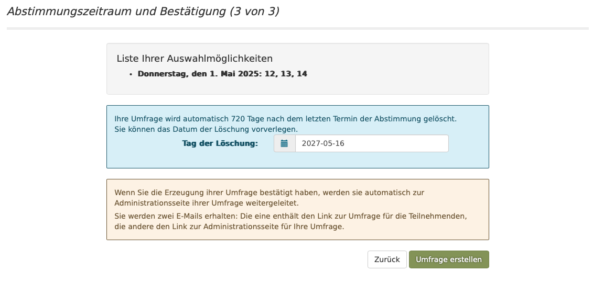

# requirement 6
as a user i want to be able to go from the step-2 page to the next form page `schedule-event-step3` to finalize the event.
 
## acceptance criteria
1. if the user is still on the second form  and clicks on the "next" button, the 3nd step form appears and the browser URL should show the URL path `/schedule-event-step3/<UUID>`
2. the layout of the step-3 form should look similar to  
3. if the user is on `schedule-event-step3` and clicks the "back" button, the previous from  appears again including the data he already has entered
4. the "Expiry Date" on `schedule-event-step3` defaults to a date which is calculated this way:
    * take the date from step 2 and add 3 months 
5. this new step 3 should have also a back button as the stages before and a "create the poll" button which would show a summary of the event. (but this new summary page will be defined in a new requirement)  
6. if the `schedule-event-step3` is called with a UUID as path parameter the corresponnding S3 should be retrieved and shown to the user.
7. if the `schedule-event-step3` is called without a UUID as path parameter or without the parameter at all the user should be redirected to the `schedule-event` page, and showing the warning that the UUID was not found, just as it is already implemented for the step-2. 